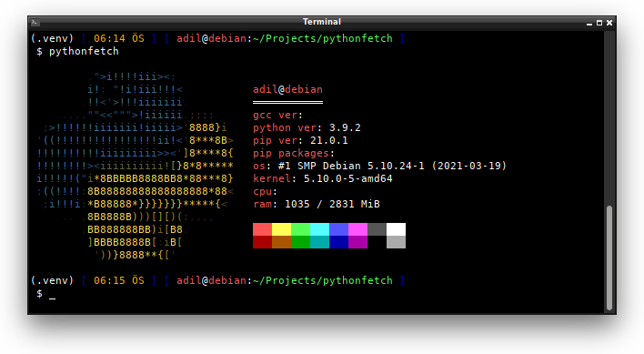

# pythonfetch


Python and system information command-line tool



### Availability
Only GNU/Linux 🐧

## Installation and Building

Install via `pip` (No auto-update):
```
$ [sudo] pip3 install pythonfetch
```

### Building the sources
1. Clone the reporistrory:
```
$ git clone https://github.com/beucismis/pythonfetch
$ cd pythonfetch/
```
2. Create a virtual environment (Optionally):
```
$ virtualenv .venv
$ source .venv/bin/activate
```
3. Install the pythonfetch's dependencies:
```
$ pip3 install -r requirements.txt
```
4. Run build and install:
```
$ python3 setup.py build
$ python3 setup.py install
```

## Usage
```
$ pythonfetch
```

## License
This project is licensed under the GPL-3.0 - see the [LICENSE](LICENSE) file for details.
